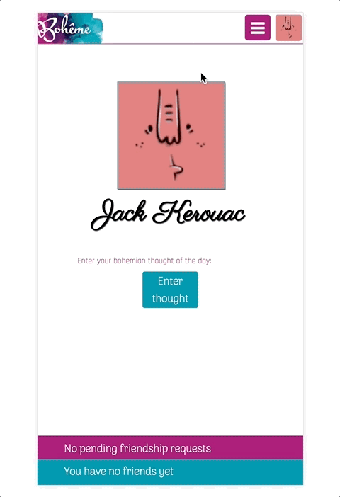
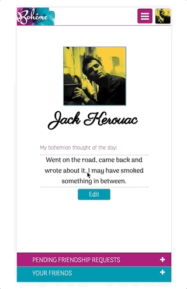
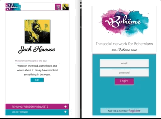
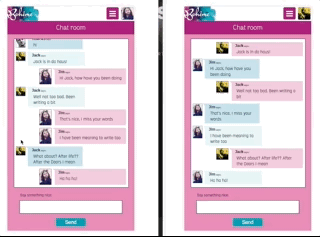
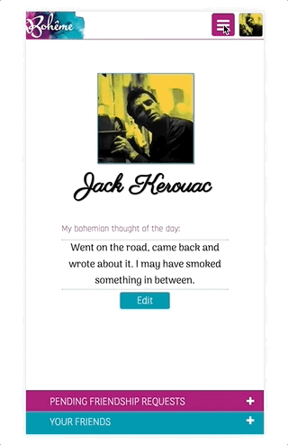

# Bohême - The social network for bohemians

### Contents

- [Overview](#overview)
- [Tech stack](#tech stack)
- [Description](#description)

## Overview

**Boheme** is a mock social network I built during my participation on SPICED Academy (Berlin), an 12-week coding bootcamp focused on full stack JavaScript web development. This was the last project of the program and it taught us how to build complex single-page applications using **ReactJS, Redux and Socket-IO**. All these were technologies I had never used before.

**Time frame:** 3 weeks

## Tech stack:

- **Frontend**: ReactJS, ReduxJS, Socket-IO
- **Backend**: NodeJS, ExpressJS,  Socket-IO
- **Databases**: PostgreSQL, AWS S3

## Description

Bohême is a **mobile only** application.

The welcome page allows you to **register** or, if you are already registered, you can login using the appropriate form. The password is encrypted before storing it in the database.

Once you are registered or logged in, you land on the profile page.

The application will initially assign you an individual profile picture (courtesy of [Adorable Avatars](http://avatars.adorable.io)). You can also **upload your own profile picture** clicking on the top small picture on the top of the screen.

On your profile page you can enter your *bohemian thought of the day* . This thought can be modified at any time.

On the bottom of the screen is the **Friendship** area. Two collapsable menus on the bottom of the screen display the friendship requests you have not accepted yet as well as your current friends. The requests that you accept will automatically be moved to the friends area.

When you click on the hamburger menu of the top bar a navigation bar is displayed, through which you can access different parts of the application:

**Online Users**: Here you can find all users who are currently logged in the application. When a user logs in, its picture and name will appear on the screen.

**Chat Room**: In the chat room you can chat live with all users. The messages you send will be displayed on the right part in pink color. The messages from other users will be displayed on the left part in different shades of blue.

**All Users**: Here you can see all users, their names and pictures, who have registered in the application. The button underneath each picture shows you the current state of your friendship with this user.

###Contact
email: raul4cade@gmail.com
Twitter: [@raulif](https://twitter.com/raulif)
LinkedIn: [Raul Iglesias](https://www.linkedin.com/in/raul-iglesias-fourcade/)
